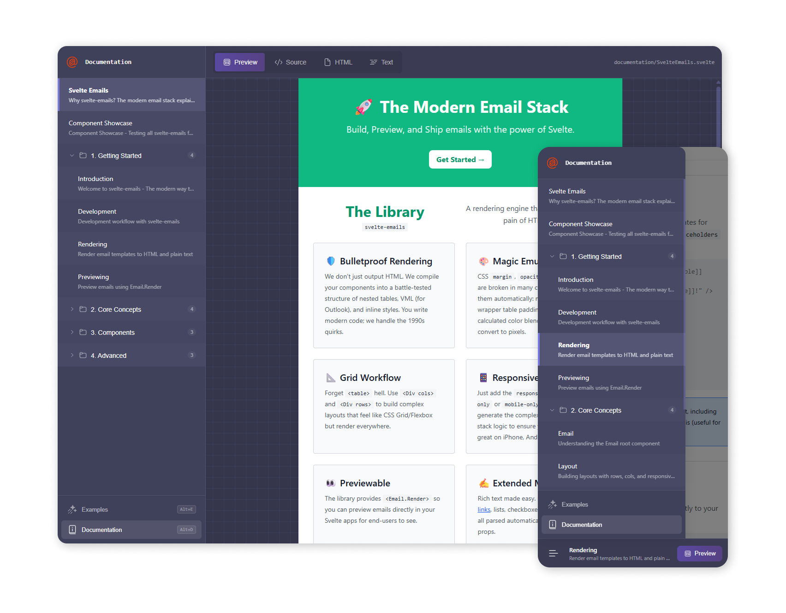

<p align="center">
  
</p>

<h1 align="center">svelte-emails</h1>

<p align="center">
  <strong>Think Tailwind for emails.</strong><br>
  Build responsive, bulletproof HTML emails with Svelte components and familiar styling.
</p>

<p align="center">
  <a href="https://refzlund.github.io/svelte-emails/documentation/svelteemails">📚 Documentation</a> •
  <a href="#quick-start">🚀 Quick Start</a> •
  <a href="#why-svelte-emails">🤔 Why?</a>
</p>

---

<p align="center">
  
</p>

---

<br>

## Why svelte-emails?

HTML email is stuck in the 1990s. Tables for layout. Inline styles everywhere. Outlook breaking everything. 

**svelte-emails** handles the chaos so you don't have to:

- Write modern **Svelte components** with Tailwind-like styling
- We compile to **bulletproof nested tables**, VML, and inline styles
- **Works everywhere**: Gmail, Outlook, Apple Mail, Yahoo, and beyond

```svelte
<script lang="ts">
  import { Email, Div, Text, Button } from 'svelte-emails'
</script>

<Email preview="Welcome to our platform!">
  <Div p-8 bg-[#f3f4f6]>
    <Text.H1 content="Welcome, **[[first_name]]**! 👋" />
    <Text content="We're thrilled to have you on board." />
    <Button href="https://example.com" bg-[#3b82f6] text-[#fff] rounded px-6 py-3 content="Get Started →" />
  </Div>
</Email>
```

That's it. No `<table>` nightmares. No inline `style=""` spaghetti. Just clean, readable code.

<br>

---

<br>

## Quick Start

### Installation

```bash
bun add -D svelte-emails
# or: npm install -D svelte-emails
```

<br>

### Create your first email

Create a file named `Welcome.email.svelte`:

```svelte
<script lang="ts">
  import { Email, Div, Text } from 'svelte-emails'
</script>

<Email preview="Welcome!">
  <Div p-6 bg-[#ffffff]>
    <Text.H1 content="Hello World" />
    <Text content="This is my first email." />
  </Div>
</Email>
```

<br>

### Preview it

```bash
bunx svelte-emails
# or: npx svelte-emails
```

That's it! Open the URL and see your email rendered live with hot reload.

### Send it

```typescript
import { render } from 'svelte-emails'
import WelcomeEmail from './Welcome.email.svelte'

const { html, text, headers } = await render(WelcomeEmail, {
  placeholders: { first_name: 'Alice' }
})

// Send with any provider: Resend, SendGrid, Nodemailer, AWS SES...
await emailProvider.send({
  from: 'hello@example.com',
  to: 'alice@example.com',
  subject: 'Welcome!',
  html,
  text,
  headers
})
```

---

<br>

<p align="center">
  <strong>Not convinced yet?</strong><br>
  <a href="https://refzlund.github.io/svelte-emails/documentation/svelteemails">📚 See the documentation</a> — built entirely on the foundation of the library itself.
</p>

<br>

---

<br><br>

## License

MIT © [Refzlund](https://github.com/Refzlund)